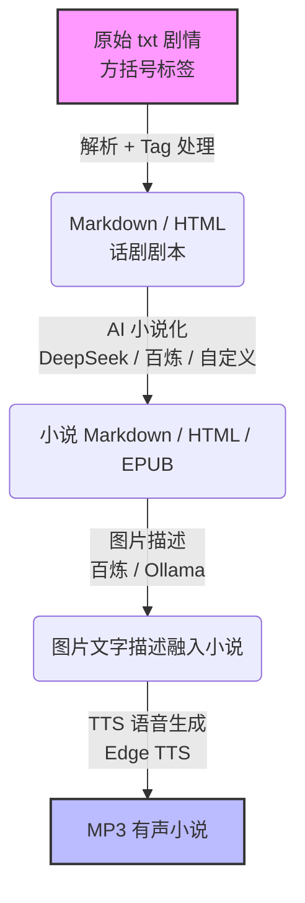

# ArkPlot - 把明日方舟剧情变成你的专属小说

> **挂机刷本太枯燥？肉鸽奋战想听书？剧情太长懒得戳？**  
> ArkPlot 一键将明日方舟原始剧情转化为**多角色配音小说**，让泰拉大陆的故事随时伴你左右。

---

<div align="center">


### ✨ 明日方舟剧情文本转换器 · 话剧剧本 · AI小说化 · 多角色TTS有声书 ✨

</div>

---

## 🌟 核心亮点

| 🎭 **三种文本格式** | 🤖 **AI 智能小说化** | 🔊 **多角色有声书** | 🌍 **全服支持** |
|:------------------:|:------------------:|:------------------:|:-------------:|
| 话剧剧本 / 流畅小说 / 有声小说脚本 | DeepSeek / 百炼 / 自定义 OpenAI 接口 | Edge TTS 独立音色 · 批量生成 MP3 | 中日英韩四服务器剧情 |
| 🖼️ **图片智能描述** | 📚 **EPUB 电子书** | 🎨 **跨平台 UI** | ⚡ **智能缓存** |
| 视觉模型自动生成立绘场景描述 | 一键导出 EPUB 随身携带 | Avalonia 支持 Win/Linux/macOS | 重复生成不重复调用 API |

---

## 🎯 这是什么？

你是否也曾：
- 🎮 打肉鸽/刷材料时，想听剧情却没法后台播放？
- 📖 想补旧活动剧情，却不想一次次点开游戏回放？
- 🎧 想要沉浸式听剧情，却只有单角色旁白？
- 📱 想把剧情存进手机，通勤路上随时听？

**ArkPlot 就是为此而生！**

它直接读取明日方舟官方剧情数据，自动解析处理：
- 📝 生成排版精美的**话剧剧本**（Markdown/HTML）
- 🤖 调用大模型将对话剧本**AI 小说化**，变成流畅的叙事小说
- 🖼️ 视觉模型自动描述立绘和场景，融入文本
- 🔊 **多角色独立 TTS 配音**，一键生成完整有声书 MP3
- 📚 导出 EPUB 电子书，任何设备都能阅读

---

## 主要功能

- 支持中日英韩四服务器剧情文本生成
- 随游戏更新自动获取新剧情（视实际情况可能会有延迟）
- 处理游戏内原文本，可自定义 tag 及其处理用的正则表达式
- Avalonia 跨平台 UI（Windows / Linux / macOS）
- 🤖 **AI 小说化**：支持 DeepSeek、百炼及自定义 OpenAI 兼容接口，自动将剧本转化为连贯小说
- 🖼️ **图片描述**：调用视觉模型为立绘和场景图生成文字描述，融入小说文本
- 🔊 **TTS 语音生成**：多角色独立音色，批量生成 MP3，行级播放器预览，支持 Edge TTS 和自定义引擎
- 📚 **EPUB 导出**：小说化文本可自动生成 epub 电子书（需安装 [Pandoc](https://pandoc.org/)）

## 处理管线



## 界面截图

<table>
  <tr>
    <td align="center"><b>主界面</b></td>
    <td align="center"><b>TTS 语音生成</b></td>
  </tr>
  <tr>
    <td></td>
    <td></td>
  </tr>
  <tr>
    <td align="center"><b>Tag 编辑器</b></td>
    <td align="center"><b>设置界面</b></td>
  </tr>
  <tr>
    <td></td>
    <td></td>
  </tr>
</table>

## 输出效果

<table>
  <tr>
    <td align="center"><b>默认 HTML（话剧）效果</b></td>
    <td align="center"><b>HTML（小说）效果</b></td>
  </tr>
  <tr>
    <td></td>
    <td></td>
  </tr>
  <tr>
    <td align="center"><b>Typora + Autumns 主题效果</b></td>
    <td></td>
  </tr>
  <tr>
    <td></td>
    <td></td>
  </tr>
</table>

## 快速上手

1. 前往 [Releases](https://github.com/drunkenQCat/ArkPlotWpf/releases) 下载对应平台版本，解压运行
2. 选择活动名，点击「开始」，自动拉取剧情数据并生成 Markdown / HTML
3. 如需小说化：在设置页配置 API Key，主界面勾选「启用小说化生成」后点开始
4. 如需 TTS：确保已生成小说文件（`_novel.md`），点击「TTS 语音生成」，配置角色音色后点「生成整章」

> 运行前请确保 [.NET 9.0 运行时](https://dotnet.microsoft.com/zh-cn/download/dotnet/9.0) 已安装。

## 下载

| 平台 | 文件 |
|------|------|
| Windows x64 | `ArkPlot_x.x.x_win-x64.zip` |
| Linux x64 | `ArkPlot_x.x.x_linux-x64.tar.gz` |
| macOS x64 | `ArkPlot_x.x.x_osx-x64.tar.gz` |

## 功能详情

### 🤖 AI 小说化

调用 LLM 将 AVG 剧本转化为连贯小说文本。支持 DeepSeek（V4 Pro / Flash）、百炼平台（GLM、MiniMax、Kimi 等）及任意 OpenAI 兼容接口。在设置页配置 API Key，主界面勾选「启用小说化生成」即可。生成结果按章节缓存（MD5 hash），重复运行不重复调用 API。可额外导出 HTML 和 EPUB（需安装 [Pandoc](https://pandoc.org/)）。

👉 [详细指南](docs/ai-novelization.md)（平台配置、模型选择、自定义 Provider）

### 🖼️ 图片描述

调用视觉模型为立绘和场景图生成文字描述，融入小说文本。支持百炼（qwen-vl 系列）、Ollama（本地运行）及自定义 OpenAI 兼容接口。在设置页选择 Provider 和模型，主界面勾选「启用图片描述」即可。描述结果缓存到数据库，同一图片不重复调用。已知干扰图（纯黑背景、空白角色）自动跳过。

👉 [详细指南](docs/pic-description.md)（Provider 配置、系统提示词、缓存机制）

### 🔊 TTS 语音生成

将小说化文本转化为多角色配音的有声小说 MP3。每个角色自动分配 Edge TTS 音色（支持性别推断），可手动调整。一键生成整章，DataGrid 每行带独立播放器可预览，连播模式下自动滚动 + 场景联动。生成结果缓存，重复运行只生成新增片段。

👉 [详细指南](docs/tts-guide.md)（界面说明、音色配置、对齐缓存）

## 开发说明

本项目使用 .NET 9.0

### 项目结构

| 项目 | 说明 |
|------|------|
| `ArkPlot.Core` | 核心逻辑：解析器、数据模型、Tag 处理、图片描述管线 |
| `ArkPlot.Avalonia` | Avalonia 跨平台桌面 GUI（SukiUI 主题） |
| `ArkPlot.Tts` | TTS 语音生成：对齐管线、Edge TTS 引擎、章节合成编排 |
| `ArkPlot.Novelizer` | LLM 小说化管线，支持 DeepSeek/百炼/自定义 OpenAI 兼容接口 |
| `ArkPlot.Vision` | 视觉模型调用模块，支持百炼和 Ollama |

### 构建

```bash
dotnet build ArkPlot.Avalonia/ArkPlot.Avalonia.csproj
```

## 用到的部分开源库

- 游戏数据：[Kengxxiao/ArknightsGameData](https://github.com/Kengxxiao/ArknightsGameData)
- UI 框架：[Avalonia](https://avaloniaui.net/) + [SukiUI](https://github.com/kikipoulet/SukiUI)
- MVVM：[CommunityToolkit.Mvvm](https://github.com/CommunityToolkit/dotnet)
- Markdown 转换：[Markdig](https://github.com/xoofx/markdig)
- JSON：[Newtonsoft.Json](https://github.com/JamesNK/Newtonsoft.Json)
- ORM：[SqlSugar](https://github.com/DotNetNext/SqlSugar)
- Markdown 样式：[MarkdownPad2AutoCatalog](https://gitee.com/cayxc/MarkdownPad2AutoCatalog)
